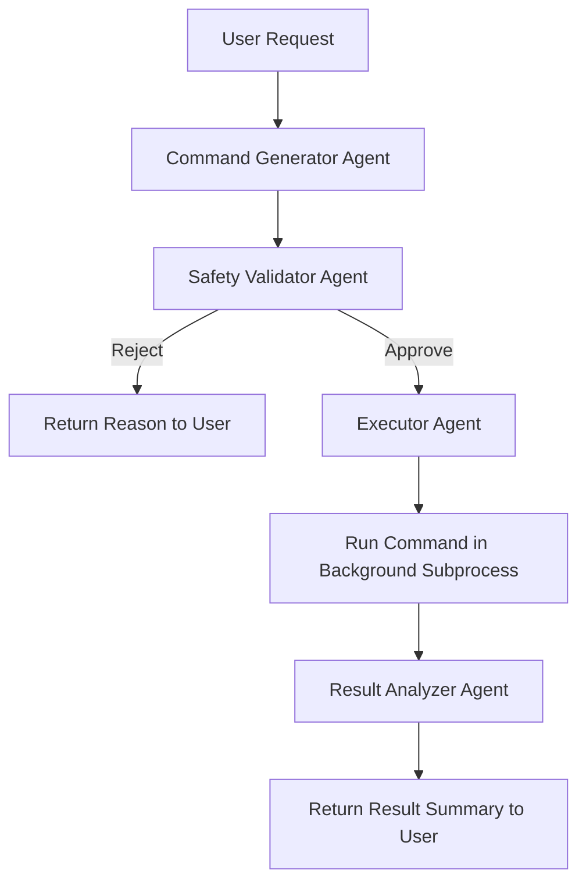

# ostrich

# OS Automation Agent — Design Document (CrewAI)

## 1. Overview

A CrewAI-based agent system that takes a natural-language system task (e.g. *"free up disk space"*, *"mute audio and lock the screen"*) and turns it into a shell command (Bash on Linux/macOS, PowerShell on Windows), validates it for safety, and executes it in the background — covering the capability areas listed below.

**Capability domains covered:**
File & Directory Management · Process & Application Control · Window & UI Manipulation · System & Power Management · Hardware & Peripheral Control · Network Configuration · Text & Clipboard Operations

---

## 2. Crew Composition

OS and permission detection now happens once at **installation time** (not per-request), so the runtime crew only covers generation, execution, and result analysis.

| Agent | Role | Responsibility |
|---|---|---|
| **Command Generator** | Coding agent | Converts the user request into an exact shell command, using the OS/permissions profile captured at install time. |
| **Safety Validator** | Guardrail | Checks the generated command against a denylist/allowlist and risk rules before execution is permitted. |
| **Executor** | Runner | Executes the approved command in a background subprocess and captures stdout/stderr/exit code. |
| **Result Analyzer** | Observer | Interprets the raw execution output, determines success/failure, and produces a human-readable summary + log entry. |

This is intentionally a **linear crew** (sequential process), not a graph of looping agents — kept simple as requested.

---

## 3. Workflow Diagram



---

## 4. Safety Validator — Minimum Rule Set

Since this agent can touch destructive OS operations (delete, force-quit, shutdown, reboot, permission changes), the Safety Validator should hard-block or require explicit confirmation for:

- Recursive deletes (`rm -rf`, `Remove-Item -Recurse -Force`) outside a scoped/whitelisted directory
- Disk formatting / partition commands
- Shutdown, reboot, or logout unless explicitly requested by the user in that turn
- Permission changes to system-critical paths (`/etc`, `/System`, `C:\Windows`)
- Any command targeting a path outside an allowed working-directory scope

Recommended approach: maintain an **allowlist of command prefixes per capability domain** rather than a denylist alone — denylists are easy to bypass with command variations.

---

## 5. Tech Stack

- **Framework:** CrewAI (sequential `Process.sequential`)
- **LLM:** Claude (via Anthropic API) or your model of choice, per-agent
- **Execution:** Python `subprocess.Popen` for background execution, OS-detected via `platform.system()`
- **Shell targets:** `bash -c "<cmd>"` (Linux/macOS) / `powershell -Command "<cmd>"` (Windows)
- **Logging:** structured JSON log per run (plan, command, validation result, output, exit code, timestamp)

---

## 6. Minimal Crew Definition Sketch (Python/CrewAI)

```python
from crewai import Agent, Task, Crew, Process

# os_profile is captured once at install time and passed in as context,
# not re-detected on every run
generator = Agent(role="Command Generator", goal="Produce exact shell command for the request, given the install-time OS profile", ...)
validator = Agent(role="Safety Validator", goal="Approve or reject the command against safety rules", ...)
executor = Agent(role="Executor", goal="Run approved command and capture output", ...)
analyzer = Agent(role="Result Analyzer", goal="Interpret execution output and summarize success/failure", ...)

crew = Crew(
    agents=[generator, validator, executor, analyzer],
    tasks=[generate_task, validate_task, execute_task, analyze_task],
    process=Process.sequential,
)

result = crew.kickoff(inputs={"request": user_request, "os_profile": os_profile})
```

---

## 7. Notes

- Keep the Safety Validator as a **separate agent**, not a step folded into the Command Generator — separating "write the command" from "judge the command" avoids the same reasoning pass approving its own risky output.
- Start with a small allowlist covering only the capability domains you need first (e.g. file management + power management), then expand.
- The `os_profile` (OS type, shell, user permission level) is resolved once during installation and stored/passed in as static context — the runtime crew only reads it, never re-detects it.
