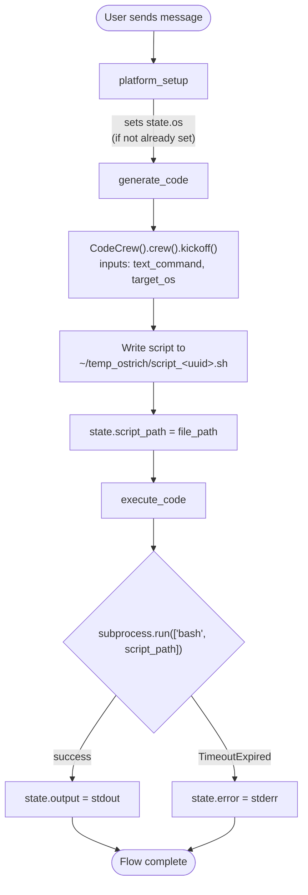

```mermaid
flowchart TD
    Start([User sends message]) --> A[platform_setup]
    A -->|"sets state.os<br/>(if not already set)"| B[generate_code]
    B --> B1["CodeCrew().crew().kickoff()<br/>inputs: text_command, target_os"]
    B1 --> B2["Write script to<br/>~/temp_ostrich/script_&lt;uuid&gt;.sh"]
    B2 --> B3["state.script_path = file_path"]
    B3 --> C[execute_code]
    C --> C1{"subprocess.run(['bash', script_path])"}
    C1 -->|success| C2["state.output = stdout"]
    C1 -->|TimeoutExpired| C3["state.error = stderr"]
    C2 --> End([Flow complete])
    C3 --> End
```
