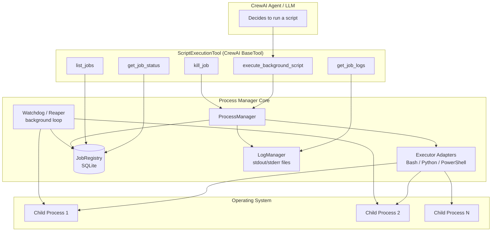
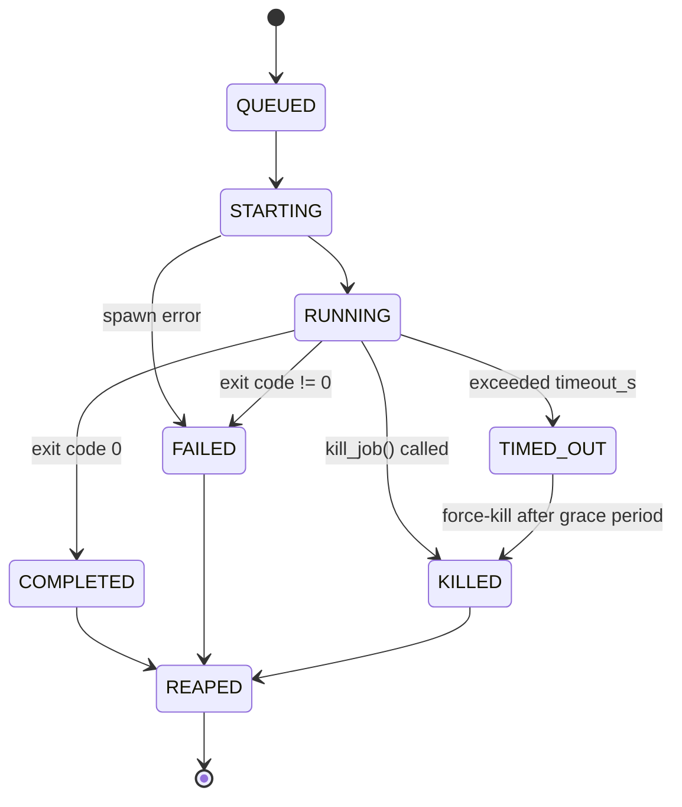

# System Design: Background Script Execution Crew

A CrewAI tool/agent component that generates and runs bash / Python / PowerShell scripts as **non-blocking background processes**, with full lifecycle tracking and deterministic orchestration behavior.

---

## 1. Goals

- **Non-blocking execution** — the crew hands off a script and immediately gets a job handle back; it doesn't sit inside a blocking `subprocess.run()` call.
- **Real process management** — track PID, detect completion, reap zombies, kill process trees, survive a crew restart without losing track of running jobs.
- **Determinism** — same job spec → same orchestration decisions every time. This does **not** mean "the script always produces identical output" (impossible in general — a script can `curl` an API or read the clock). It means:
  - the crew's *decisions* (when to mark FAILED, when to kill, what schema it returns) never depend on timing races, ambient environment, or hidden state
  - the *execution environment* itself is pinned and reproducible, so well-behaved scripts are as reproducible as possible

Non-goals: long-running services/daemons management, multi-tenant isolation, container orchestration (though the design plugs into one if needed later).

---

## 2. Architecture



**Components**

| Component | Responsibility |
|---|---|
| `ScriptExecutionTool` | CrewAI-facing interface; the only thing the LLM calls |
| `ProcessManager` | Spawns processes, owns lifecycle transitions, kills process trees |
| Executor Adapters | Normalize invocation per script type (bash/python/pwsh), platform-specific |
| `JobRegistry` (SQLite) | Durable, queryable record of every job — survives crew restarts |
| `LogManager` | Redirects stdout/stderr to files; supports tailing |
| Watchdog/Reaper | Polls process liveness, enforces timeouts, reaps zombies |

---

## 3. Job Lifecycle (state machine)



Every transition is written to `JobRegistry` with a UTC timestamp (monotonic clock used for timeout math, wall clock only for display — avoids NTP jump bugs).

---

## 4. Spawning & platform handling

**Linux/macOS (bash, python):**
```python
proc = subprocess.Popen(
    argv,                      # explicit list, never shell=True
    cwd=explicit_workdir,
    env=pinned_env,            # not os.environ — see §6
    stdout=open(stdout_path, "wb"),
    stderr=open(stderr_path, "wb"),
    start_new_session=True,    # setsid — detaches from crew's process group
)
```
- `start_new_session=True` means the child survives independently and can be killed as a whole group later via `os.killpg(pgid, signal)`.
- Redirect to **files**, not pipes — pipes deadlock once their OS buffer fills on a long-running background process nobody is actively reading from.

**Windows (ps1, python):**
```python
proc = subprocess.Popen(
    ["powershell.exe", "-NoProfile", "-ExecutionPolicy", "Bypass", "-File", script_path],
    creationflags=subprocess.CREATE_NEW_PROCESS_GROUP,
    ...
)
```
- Wrap in a **Job Object** (via `pywin32`) so any child processes PowerShell spawns get cleaned up together — otherwise orphaned grandchildren survive a kill.

**PID-reuse safety:** store `(pid, process_create_time)` as a signature, not pid alone. Before trusting a "still running" check after a crash/restart, verify both — the OS can recycle a pid to an unrelated process.

---

## 5. Termination

1. `kill_job(id)` → send graceful signal: `SIGTERM` (Unix) / `CTRL_BREAK_EVENT` or `taskkill` (Windows).
2. Wait up to a configurable grace period (default 5s).
3. If still alive → force kill the **entire tree**, not just the parent pid:
   - Unix: `os.killpg(pgid, signal.SIGKILL)`
   - Windows: terminate the Job Object
   - Cross-platform fallback: enumerate children via `psutil.Process(pid).children(recursive=True)` and kill each.
4. Mark `KILLED` → `REAPED` in the registry.

---

## 6. Determinism mechanisms

- **Pinned interpreters** — resolve to an absolute path (`/usr/bin/python3.11`, not `python`) at job-creation time and store it in the registry, so behavior doesn't silently change if PATH changes later.
- **Explicit environment** — construct `pinned_env` from an allowlist + job-supplied overrides; never inherit the crew's ambient `os.environ` wholesale. Removes "works on my machine" drift between runs.
- **Explicit working directory** — always passed, never relative to whatever the crew process's CWD happens to be.
- **Idempotency key (optional)** — if the LLM resubmits a semantically identical job (same script hash + same key), the tool returns the existing job instead of double-spawning.
- **Versioned, fixed-shape status schema** — the tool always returns the same JSON structure (`job_id`, `status`, `exit_code`, `started_at`, `ended_at`, `stdout_tail`, `stderr_tail`), so the LLM's downstream reasoning isn't parsing free-form text that varies run to run.
- **No sleep-poll races** — status reads come from the registry (updated by the watchdog via `os.waitpid(pid, os.WNOHANG)` on Unix, or `WaitForSingleObject` on Windows), not from a caller-side timing guess.

---

## 7. Recovery after crew restart

On startup, `ProcessManager` reconciles the registry:

- For every job still marked `RUNNING`: check if `(pid, create_time)` signature is still alive.
  - Alive → re-attach the watchdog to it, continue normal lifecycle.
  - Not alive / signature mismatch → mark `CRASHED_UNKNOWN` rather than guessing `COMPLETED` or `FAILED` — deterministic honesty about the ambiguity, surfaced for review instead of silently assumed.

---

## 8. Tool interface (CrewAI)

```python
class ScriptExecutionTool(BaseTool):
    name = "execute_background_script"
    description = "Run a bash/python/powershell script as a tracked background process."

    def _run(self, script_type: Literal["bash", "python", "powershell"],
              code: str, timeout_s: int = 300,
              env: dict | None = None,
              idempotency_key: str | None = None) -> dict:
        # writes code to a temp script file, spawns it, returns immediately
        return {"job_id": "...", "status": "QUEUED"}
```

Companion tools exposed the same way: `get_job_status(job_id)`, `get_job_logs(job_id, tail_lines=100)`, `kill_job(job_id)`, `list_jobs(status_filter=None)`.

Keeping these as **separate tools** (rather than one mega-tool with modes) makes the LLM's tool-selection more deterministic — each call has one unambiguous shape and return type.

---

## 9. Security (relevant given LLM-generated scripts)

- Never `shell=True` with string-concatenated commands — always a list of args, script body written to a temp file, executed via explicit interpreter path.
- Hash + log every script body before execution (audit trail against prompt-injection-driven destructive commands).
- Resource limits: `resource.setrlimit` (CPU time, memory, open fds) on Unix; Job Object limits on Windows.
- Optional allowlist of permitted binaries/paths for generated scripts — defense in depth beyond "trust the LLM."
- Run OS-automation scripts under a least-privilege service account, not the crew's own user if avoidable.

---

## 10. Persistence schema (SQLite)

```
jobs(
  id TEXT PRIMARY KEY,        -- uuid
  script_type TEXT,
  script_hash TEXT,
  command TEXT,
  pid INTEGER,
  pid_create_time REAL,
  status TEXT,
  exit_code INTEGER,
  created_at TEXT, started_at TEXT, ended_at TEXT,
  timeout_s INTEGER,
  stdout_path TEXT, stderr_path TEXT,
  idempotency_key TEXT
)
```

---

## 11. Failure modes summary

| Failure | Handling |
|---|---|
| Timeout exceeded | graceful term → grace period → force kill → `TIMED_OUT` |
| Immediate crash | exit code captured → `FAILED` |
| Crew process restarts mid-job | reconciliation on startup (§7) |
| Zombie processes | reaper loop (`waitpid`/`WNOHANG` on Unix; auto on Windows) |
| PID reused by unrelated process | `(pid, create_time)` signature check prevents false "alive" reads |

---

## 12. Observability

- Structured JSON log line per state transition, keyed by `job_id`.
- Log files tailable for long-running jobs; optional streaming callback into the agent loop for very long jobs.
- Basic metrics worth tracking: job duration distribution, success/failure/timeout rate per script type.
